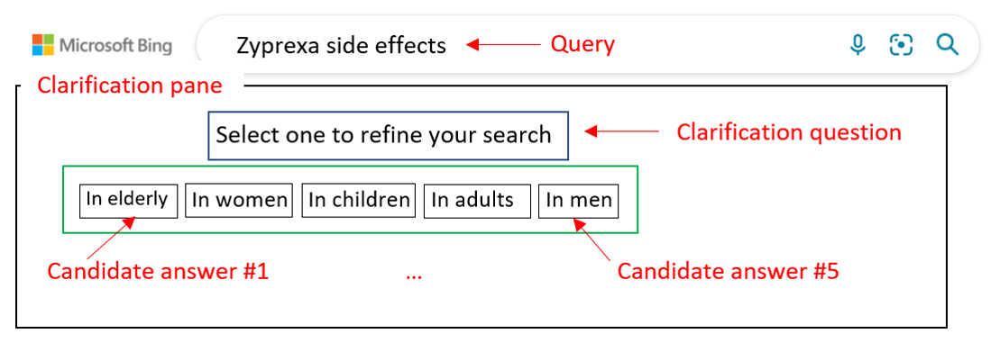

# MIMICS-Duo: Offline & Online Evaluation of Search Clarification
Asking clarification questions is an active area of research; however, resources for training and evaluating search clarification methods are not sufficient. We introduced MIMICS-Duo, a search clarification data collection containing both online and offline evaluations. 
MIMICS-Duo was designed to work with the existing MIMICS-ClickExplore dataset and contains 306 unique queries with multiple clarification panes (1,034 query-clarification pairs) with interactions of real users, collected from the Bing search logs and graded quality labels including multiple clarification panes rating, overall quality labelling for clarification panes and their individual candidate answers and labels for different aspects of clarification panes.
MIMICS-Duo can be used for training and evaluating many search clarification tasks: generating clarification questions; ranking clarification panes (Figure 1); re-ranking candidate answers; unbiased click models and user engagement prediction for clarification; and, analysing user interaction with search clarification.

MIMICS-Duo contains three different labels as below:
+ **Clarification panes preferences-Offline Rating** Rating labels for all clarification panes generated for a given query. (Task 1)
+ **Overall quality of clarification pane-Quality Labelling** Overall quality labels for clarification panes in addition to quality labels for individual candidate answers. (Task 2) 
+ **Specific quality measures of clarification panes-Aspect Labelling** Characteristics labels including coverage, diversity, understandability and candidate answer order for every clarification pane. (Task 3)

The format of each task created and conducted on Qualtrics is also available for review.

## Data Format
The dataset is released in four tab-separated file format (TSV), with the header in the first row of each file. The column descriptions are given below. 

### MIMICS-Due (Offline Rating)

| Column(s)                           | Description                                                           |
|-------------------------------------|-----------------------------------------------------------------------|
| query                               | (string) The query text.                                              |
| question                            | (string) The clarifying question.                                     |
| option_1, ..., option_5             | (string) Up to five candidate answers.                                |
| Offline rating                      | (integer) A five-level rating label for the clarification pane.       |

### MIMICS-Due (Quality Labelling)

| Column(s)                           | Description                                                           |
|-------------------------------------|-----------------------------------------------------------------------|
| query                               | (string) The query text.                                              |
| question                            | (string) The clarifying question.                                     |
| option_1, ..., option_5             | (string) Up to five candidate answers.                                |
| Quality_Option1, …, Quality_Option5 | (integer) A five-level quality label for the clarification pane.      |
| OverallClarificationPaneQuality     | (integer) A five-level quality label for the candidate answer.        |

### MIMICS-Due (Aspect Labelling)

| Column(s)                           | Description                                                           |
|-------------------------------------|-----------------------------------------------------------------------|
| query                               | (string) The query text.                                              |
| question                            | (string) The clarifying question.                                     |
| option_1, ..., option_5             | (string) Up to five candidate answers.                                |
| coverage                            | (integer) A five-level label for the coverage of clarification pane.  |
| diversity                           | (integer) A five-level label for the diversity of clarification pane. |
| understandability                   | (integer) A five-level label for the understandability of clarification pane.        |
| importance order                    | (integer) A five-level label for the candidate answer order.          |

### MIMICS-ClickExploreSampling

| Column(s)                           | Description                                                           |
|-------------------------------------|-----------------------------------------------------------------------|
| query                               | (string) The query text.                                              |
| question                            | (string) The clarifying question.                                     |
| option_1, ..., option_5             | (string) Up to five candidate answers.                                |
| impression_level                    | (string) A three-level impression label (i.e., low, medium, or high). |
| engagement_level                    | (integer) A label in [0, 10] representing total user engagements.     |
| option_cctr_1, ..., option_cctr_5   | (real) The conditional click probability on each candidate answer.    |

### The Bing API's Search Results for MIMICS-Due Queries
Since the query and clarification panes were extracted from MIMICS-ClickExplore, the web search result page (SERP) information, can be downloaded from [here](http://ciir.cs.umass.edu/downloads/mimics-serp/MIMICS-BingAPI-results.zip). Each line in the file can be loaded as a JSON object and contain all information returned by the Bing's Web Search API.

